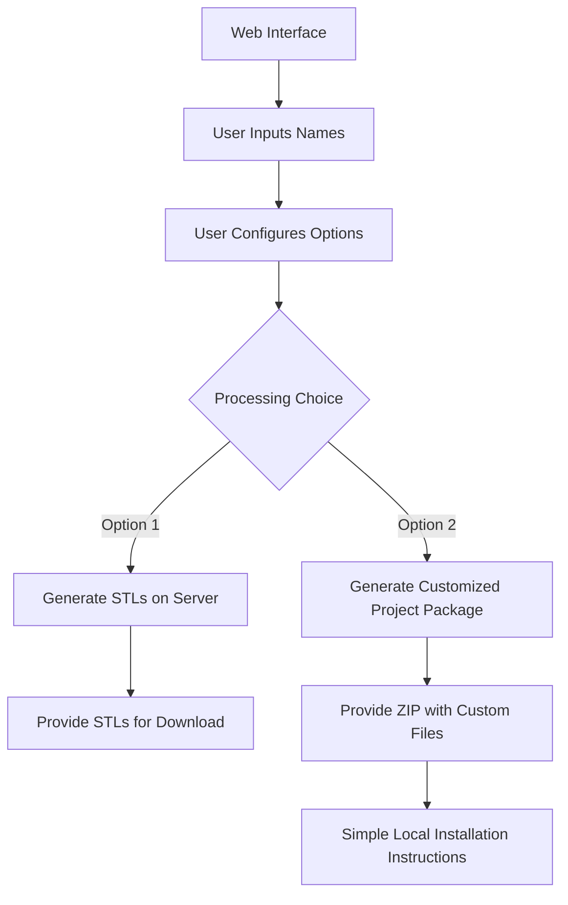

# Web-Based Name Tag Generator - Improvement Plan

## Project Vision
Create a user-friendly web interface where users can input names and generate 3D printable name tags without any coding knowledge or terminal commands.

## System Architecture

## 1. Web Interface Development

### Frontend Components
- **Name Input Section**
  - Text area for multiple names
  - CSV/Excel upload option
  - Name validation (length, special characters)
- **Configuration Options**
  - Font selection
  - Text size adjustment
  - Positioning controls
  - Clip style selection (future: multiple clip designs)
  - Scale factor control
- **Preview Section**
  - 3D preview using Three.js
  - 2D preview as fallback
- **Output Options**
  - Download individual STLs
  - Download all STLs as ZIP
  - Download customized project package

### User Experience
- Mobile-responsive design
- Clear, step-by-step workflow
- Tooltips and help guides
- Error handling with friendly messages
- Progress indicators for processing

## 2. Backend Implementation

### Option 1: Server-Side STL Generation
- **Processing Pipeline**
  - Receive name list and configuration
  - Generate custom OpenSCAD files
  - Run OpenSCAD to create STLs
  - Package STLs for download
- **Technical Requirements**
  - Server with OpenSCAD installed
  - Processing queue for multiple users
  - Temporary file management
  - Security considerations

### Option 2: Custom Project Package
- **Package Contents**
  - Pre-configured OpenSCAD template
  - Custom Python script with names pre-populated
  - Required SVG files
  - Clear installation instructions
  - Batch files/scripts for one-click generation

## 3. Deployment Strategy

### Hosting Options
- **Static Frontend + Serverless Backend**
  - Host static files on GitHub Pages/Netlify
  - Use AWS Lambda or similar for processing
- **Traditional Web Hosting**
  - VPS with OpenSCAD installed
  - Docker containers for scalability

### Performance Considerations
- Implement caching where possible
- Optimize STL generation
- Consider queue system for high traffic

## 4. Development Roadmap

### Phase 1: Core Functionality
- Basic web form for name input
- Server-side generation of downloadable ZIP package
- Minimal installation instructions

### Phase 2: Enhanced User Experience
- Add configuration options
- Implement basic preview functionality
- Improve error handling and validation

### Phase 3: Advanced Features
- Implement 3D preview
- Add direct STL generation and download
- Support for multiple clip designs
- User accounts to save configurations (optional)

### Phase 4: Optimization and Scalability
- Performance improvements
- Mobile app wrapper (optional)
- Analytics to track usage

## 5. Technical Improvements to Existing Codebase

### Python Script Enhancements
- Refactor for web integration
- Improve error handling
- Add configuration file support
- Optimize STL generation speed

### OpenSCAD Template Improvements
- Parameterize more aspects of the design
- Improve text positioning algorithm
- Add support for different fonts
- Better character width estimation

## 6. User Documentation

### Installation Guide
- Clear step-by-step instructions with screenshots
- OS-specific instructions (Windows/Mac)
- Troubleshooting section

### Usage Guide
- How to upload/enter names
- Explanation of all configuration options
- Tips for optimal printing

## Implementation Considerations

### Technology Stack Options
- **Frontend**: React, Vue.js, or simple HTML/CSS/JS
- **Backend**: Node.js, Python (Flask/Django), or PHP
- **3D Visualization**: Three.js
- **Deployment**: Netlify/Vercel + AWS Lambda or Heroku

### Security Considerations
- Input validation to prevent command injection
- File size limits
- Rate limiting to prevent abuse