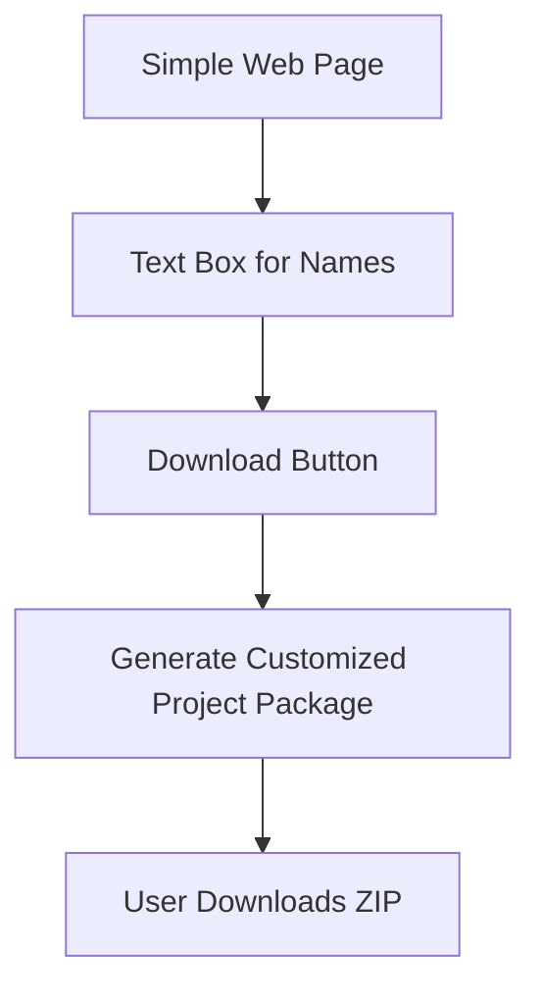
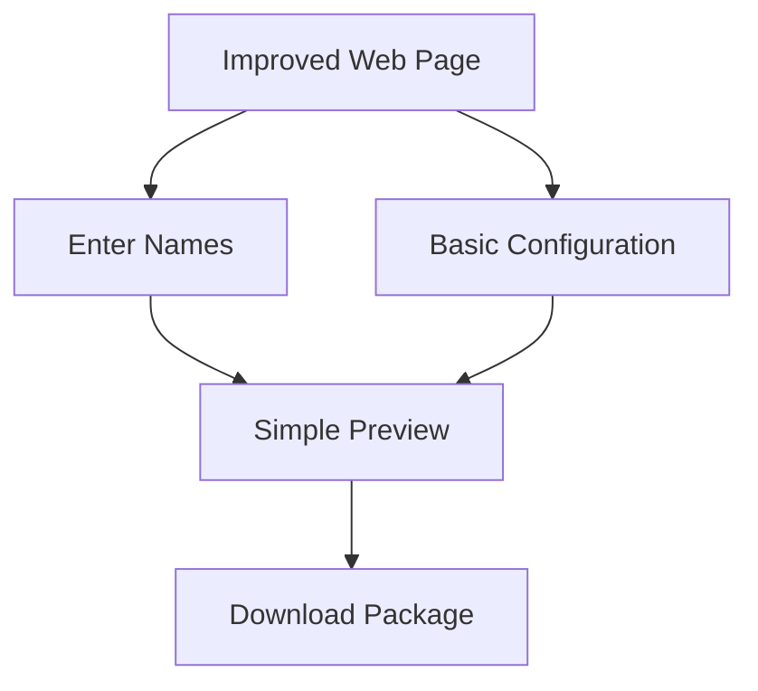

# Web-Based Name Tag Generator - Simplified Plan

## Development Philosophy
Following the "wheel → skateboard → bicycle → car" approach:
- Start with the simplest possible solution
- Focus on core functionality only
- Iterate and improve based on feedback
- Add complexity only when needed

## Phase 1: "The Wheel" (Basic Web Form)

### Implementation
- **Frontend**: Simple HTML/CSS/JS page
  - Single text box for entering names (one per line)
  - Download button
- **Backend**: Minimal serverless function
  - Receives list of names
  - Generates customized project files
  - Returns a ZIP file containing:
    - Modified `generateNames.py` with pre-populated names
    - Unmodified `templatev2.scad`
    - Unmodified `Clip1.svg`
    - Simple README with instructions

### User Experience
1. User visits the webpage
2. User enters names (one per line)
3. User clicks "Generate"
4. User downloads a ZIP package
5. User follows simple instructions to run the script locally

### Technology
- Static hosting (GitHub Pages or Netlify)
- Simple JavaScript for the form
- Minimal serverless function (AWS Lambda or similar)

## Phase 2: "The Skateboard" (Basic Enhancements)

### Enhancements
- Simple 2D preview of name tag
- Basic configuration options:
  - Text size
  - Scale factor
- Improved instructions
- Better error handling

## Phase 3: "The Bicycle" (More Features)

### Potential Features
- 3D preview using Three.js
- Direct STL generation on server
- More configuration options
- Multiple clip design options

## Phase 4: "The Car" (Full Solution)

### Advanced Features
- User accounts
- Saved configurations
- Batch processing
- All advanced features from original plan

## Implementation Timeline

### Week 1: The Wheel
- Set up static website
- Create basic form
- Implement name parsing
- Set up simple ZIP generation

### Week 2: Testing & Refinement
- Test with real users
- Refine instructions
- Fix any issues
- Deploy stable version

### Weeks 3-4: The Skateboard
- Add basic preview
- Add simple configuration
- Improve user experience

## Technology Choices

### Frontend
- Simple HTML/CSS/JavaScript
- No complex frameworks needed for initial version
- Consider Bootstrap for responsive design

### Backend
- Serverless function (AWS Lambda, Netlify Functions, etc.)
- Generate customized Python script
- Create ZIP package

### Hosting
- GitHub Pages or Netlify for frontend (free)
- AWS Lambda or similar for processing (minimal cost)

## Success Metrics
- Users can generate project packages without editing code
- Clear instructions allow non-technical users to run the script
- Fewer support questions about setup and configuration